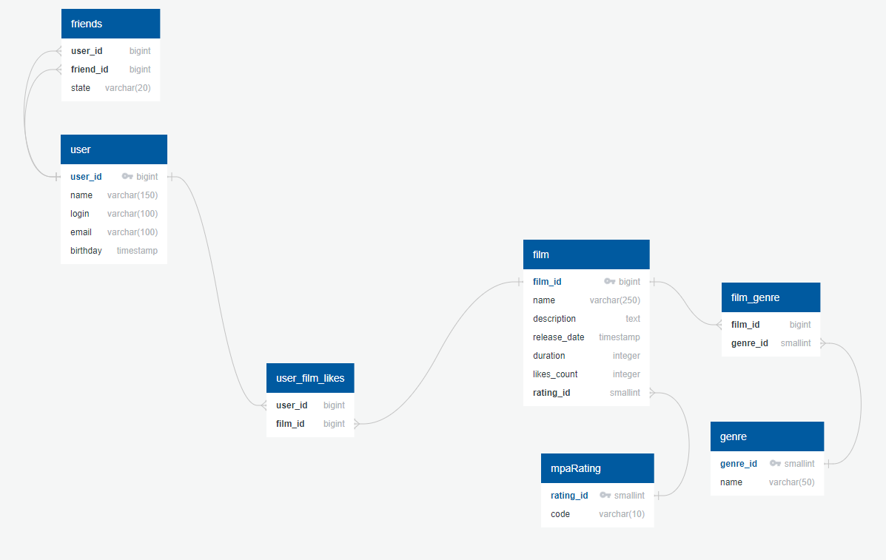

# java-filmorate
## ER-диаграмма базы данных filmorate.


## Небольшое пояснение:
БД состоит из следующих таблиц:
* user (пользователи)
* friend (список друзей пользователей)
* friendship_state ("статус" дружбы)
* film (фильмы)
* mpaRating (рейтинг MPA)
* genre (жанры фильма)
* film_genre (отношение фильмов и их жанров)
* user_film_likes (отношение фильмов и пользователей, лайкнувших эти фильмы)

## Некоторые примеры запросов в БД:
### Запрос всех пользователей:
```sql
SELECT *
FROM user;
```
### Запрос топ 10 наиболее популярных фильмов:
```sql
SELECT *
FROM film
ORDER BY likes_count DESC
LIMIT 10;
```
### Запрос всех фильмов в жанре комедия:
```sql
SELECT 
    f.film_id,
    f.name,
    f.description,
    f.release_date,
    f.duration,
    f.likes_count
    f.rating_id
FROM film_genre fg
JOIN film f ON fg.film_id = f.film_id
JOIN genre g ON fg.genre_id = g.genre_id
WHERE g.name = 'Comedy';
```
### Запрос всех подтвержденных друзей пользователя с id = 3:
```sql
SELECT *
FROM user
WHERE user_id IN (
    SELECT f.friend_id
    FROM friends f
    JOIN friendship_state fs ON f.state_id = fs.state_id
    WHERE f.user_id = 3 AND fs.state = 'ACCEPTED')
```